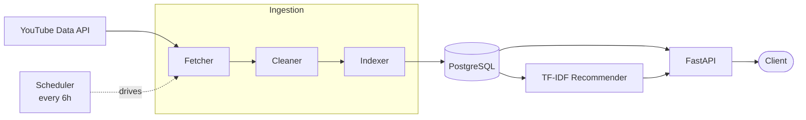

# YouTube Recommendation Engine

A trending-video analytics and recommendation service built on a layered data pipeline. It continuously ingests trending YouTube metadata, stores it in PostgreSQL, and serves content-based recommendations through a REST API.

The project is intentionally weighted toward backend and data engineering (~80%) over machine learning (~20%): the recommender is classical (TF-IDF + cosine similarity), and the emphasis is on the pipeline design, the database model, and the separation of concerns that lets each layer evolve independently.

## Architecture

Data flows in one direction, with the database as the decoupling hub. Each layer has a single responsibility and communicates only through PostgreSQL, so any stage can be changed or replaced without touching the others.



The ingestion layer writes to the database; the serving layer reads from it. The API never calls the YouTube API, and the pipeline never handles HTTP requests — the database is the only thing they share.

## How it works

**Ingestion (`pipeline/`)** runs in three stages. The *fetcher* pulls trending videos from the YouTube Data API with pagination and exponential-backoff retries, returning raw records. The *cleaner* flattens those into typed rows, parsing ISO 8601 durations into seconds and preserving missing values as `NULL` rather than coercing them to zero. The *indexer* writes the result into PostgreSQL using idempotent upserts.

**Scheduling (`pipeline/scheduler.py`)** runs the full pipeline on startup and every six hours after, using APScheduler as a standalone `BlockingScheduler`. Because the writes are idempotent, repeated runs refresh existing videos in place rather than duplicating them.

**Storage (`db/`)** is a normalized two-table schema — `channels` and `videos` — with a foreign key linking them, a GIN index on the tag array, and `created_at` / `updated_at` timestamps maintained by the upsert.

**Recommendation (`recommender/`)** builds a TF-IDF vector for each video from its tags and title, then ranks candidates by cosine similarity. The model is fit on demand and cached in memory; at this corpus size, fitting takes milliseconds, so scores are computed on request rather than precomputed to storage.

**API (`api/`)** exposes the system over HTTP with FastAPI and Pydantic response models, with interactive documentation generated automatically at `/docs`.

## Design decisions

A few choices worth calling out, with the reasoning behind them:

- **`NULL` vs. `0` for missing counts.** View/like/comment counts are nullable — an unknown count is not the same as a count of zero, and conflating them would corrupt any downstream ranking. Duration uses `0` as a deliberate documented sentinel, since no real video is zero seconds.
- **Tags as a `TEXT[]` array, not a junction table.** The recommender's hot path reads all of a video's tags together, which an array serves directly with no join. A GIN index still supports tag-containment queries. A normalized junction table would only pay off if tag-level analytics became a feature.
- **Raw SQL via psycopg2, not an ORM.** The write path uses parameterized SQL directly, keeping the `INSERT ... ON CONFLICT` upsert logic explicit and transparent.
- **On-demand recommendations, not precomputed scores.** Precomputing a similarity table would be premature at this scale; fitting TF-IDF per process is fast enough, and a `/refresh` endpoint rebuilds the cached model when the underlying data changes.
- **A decoupled scheduler.** Ingestion runs as its own worker rather than inside the web server, so refreshing data and serving requests scale and fail independently.

## Tech stack

Python 3.11 · FastAPI · PostgreSQL · psycopg2 · scikit-learn · APScheduler · httpx · Pydantic · uvicorn

## Setup

Requires Python 3.11 and a local PostgreSQL server.

```bash
# 1. Clone and enter the project
git clone https://github.com/hpat19/yt-recommendation-engine.git
cd yt-recommendation-engine

# 2. Create a virtual environment and install dependencies
python3.11 -m venv venv
source venv/bin/activate
pip install -r requirements.txt

# 3. Create the database and apply the schema
createdb yt_rec
psql yt_rec -f db/schema.sql

# 4. Configure environment variables
cp .env.example .env
# then edit .env to set:
#   YOUTUBE_API_KEY   -- a YouTube Data API v3 key
#   DATABASE_URL      -- e.g. postgresql://<user>@localhost:5432/yt_rec
```

## Running

```bash
# Populate the database with one pipeline run
python -m pipeline.run

# Or run the scheduler to refresh continuously (every 6 hours)
python -m pipeline.scheduler

# Start the API server
uvicorn api.main:app --reload
```

The API is then available at `http://127.0.0.1:8000`, with interactive docs at `http://127.0.0.1:8000/docs`.

## API

| Method | Endpoint | Description |
|--------|----------|-------------|
| `GET` | `/trending` | Most-viewed videos in the corpus. Accepts a `limit` query parameter (1–100). |
| `GET` | `/recommend/{video_id}` | Videos most similar to the given one, ranked by cosine similarity. Accepts a `limit` parameter (1–50). Returns `404` if the video is not in the corpus. |
| `POST` | `/refresh` | Rebuilds the recommender's in-memory model from the current database contents. |

## Roadmap

- **Deployment** to Google Cloud (Cloud Run + Cloud SQL), with the scheduler adapted to a request-driven trigger.
- **Collaborative filtering** as a second recommender, using a user–item interaction matrix on seeded interaction data.
- **Test coverage** across the pipeline and API.
